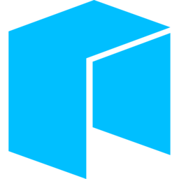

<p align="center">
  
</p>

# neoFS-mount

Mount [NeoFS](https://github.com/nspcc-dev/neofs-node) containers as a local filesystem on **Linux** (FUSE) and **macOS** (Apple **File Provider**), with a **native Windows** Cloud Files integration (CfAPI). Includes a cross-platform Fyne system tray app.

> **Project status:** neoFS-mount is **early-stage alpha** software. APIs, on-disk formats, and behavior may change without notice. **Do not use it in production** or for data you cannot afford to lose or recreate. Expect rough edges, incomplete error handling, and missing safeguards compared to mature storage clients.

## Features
- **Linux:** FUSE mount (`fuse3`); browse and edit NeoFS objects as normal files.
- **Linux FUSE resilience:** The object cache serializes concurrent fetches for the same key without recursive re-entry. File `Open` retries transient `ObjectGet` / stream errors, logs hard failures, and re-fetches if a cached blob file is missing or stale.
- **macOS:** **File Provider** host app + extension ([`macos/NeoFSMount`](macos/NeoFSMount/README.md)) linked to a **Go static library** (`macos/GoBridge`); Finder integration without macFUSE for the default path. The tray **Mount** action launches `org.neofs.mount`.
- **Windows:** Cloud Sync Provider via CfAPI (see [`internal/cfapi`](internal/cfapi/cfapi.go)).
- **Cross-Platform System Tray:** `neofs-mount-tray` for settings, GAS balance, and top-up.
- **Startup Automation:** Run at login and auto-mount options.

## Quick Start

### Linux

1. **Install FUSE:** e.g. `sudo apt install fuse3` or `sudo pacman -S fuse3`.
2. **Run the tray:** `./bin/neofs-mount-tray` and set endpoint, wallet, and mountpoint in **Settings**.

### macOS

1. Build the **NeoFS Mount** app from [`macos/NeoFSMount`](macos/NeoFSMount/README.md) (Xcode; requires Go + CGO for the bridge).
2. Install the built `.app` (bundle id **`org.neofs.mount`**). Configure **`~/Library/Application Support/neofs-mount/config.toml`** (same as the tray).
3. Open the app, **Register File Provider domain**, then use **NeoFS** in Finder. You can still run **`neofs-mount-tray`** for balance, top-up, and settings; **Mount** opens the native app.

### CLI (`neofs-mount`)

**Linux only** for a real FUSE mount at `--mountpoint`. On **macOS**, the CLI’s mount path launches the File Provider app instead of FUSE.

```bash
./bin/neofs-mount \
  --endpoint s03.neofs.devenv:8080 \
  --wallet-key /path/to/wallet.key \
  --mountpoint /tmp/neofs
```

### Unmount

- **Linux:** `fusermount3 -u /tmp/neofs` (or tray **Unmount**).
- **macOS:** Use the File Provider host app / Finder; see [docs/INSTALL.md](docs/INSTALL.md). Legacy macFUSE (if used): `umount -f <path>`.

## Building and Releasing

```bash
make build-all
```

Fyne tray builds for Mac/Linux often use [fyne-cross](https://github.com/fyne-io/fyne-cross) (see `Makefile`). The **macOS File Provider** `.app` is built with **Xcode** on a Mac (or `macos-latest` in CI).

The Linux **AppImage** target (`make build-linux-appimage`) clears a stale `bin/AppDir` before packaging and ships the main **`logo.png`** as the desktop icon (see `Makefile`).

## Documentation
- [Configuration & Settings](docs/CONFIG.md)
- [Filesystem Semantics](docs/SEMANTICS.md)
- [Troubleshooting](docs/INSTALL.md)
- [macOS File Provider app](macos/NeoFSMount/README.md)
